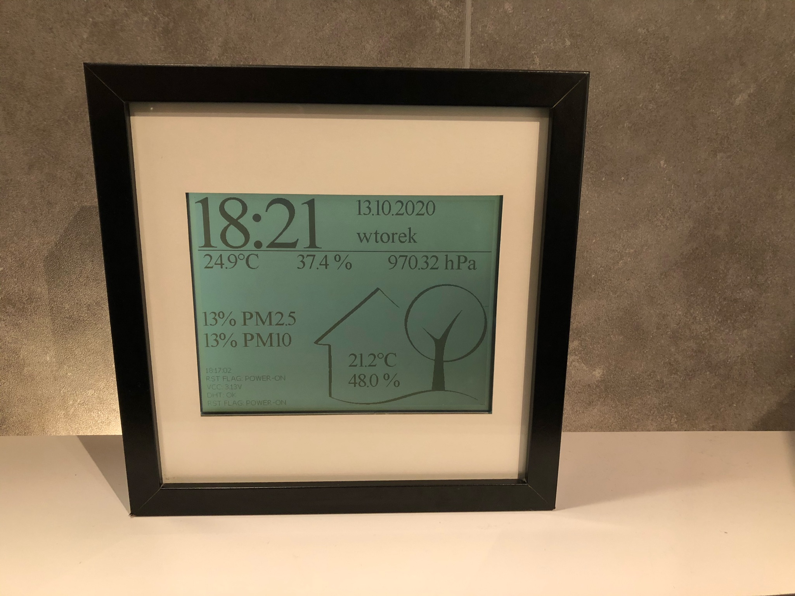
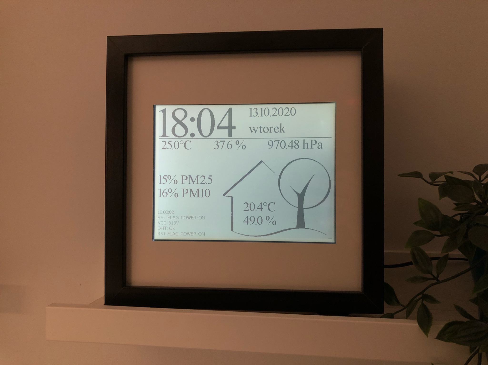
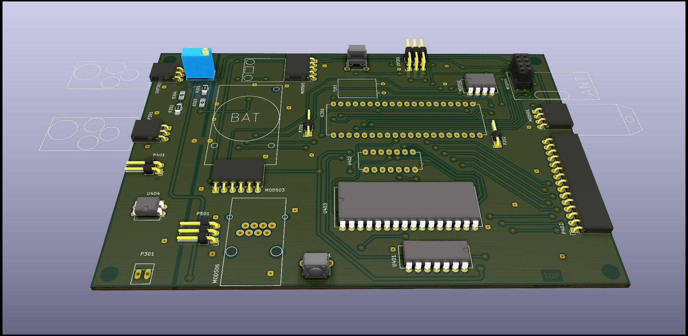
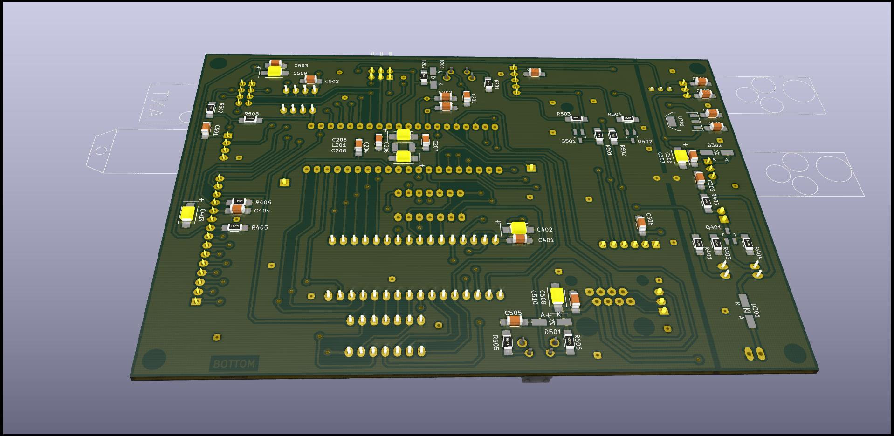
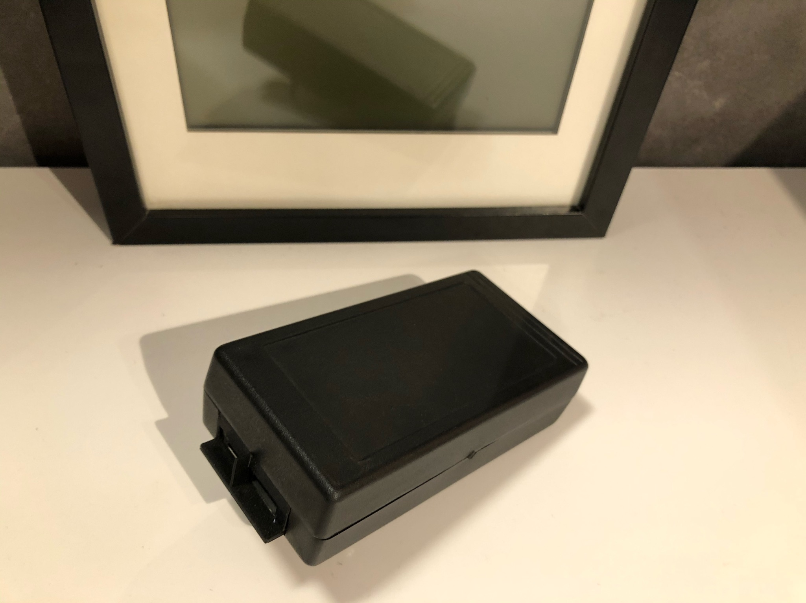
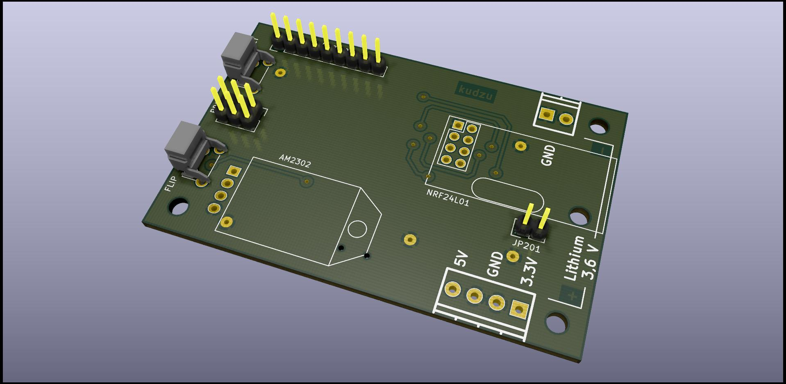
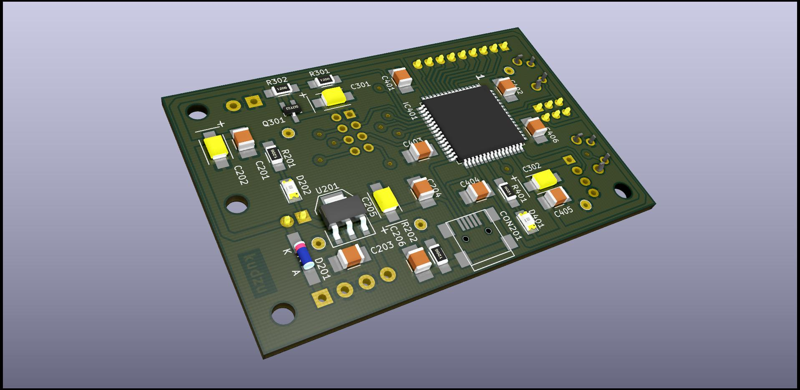

# Weather station

## Internal unit (terminal)

### Heart:
	ATmega1284
	
### Peripherals:
	EG9018C - 640x480 8.4" mono lcd screen
	DS3231 - rtc
	BMP180 - pressure sensor
	nRF24L01 - wireless transceiver
	AM2302 - temperature and humidity sensor

## External unit (sensor)

### Heart:
	ATxmega128A3U - uC
	
### Peripherals:
	PMSA003 - dust sensor
	nRF24L01
	AM2302	

